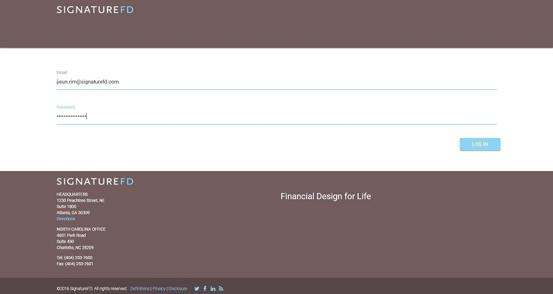

# SignatureFD Onboard

Go to https://signaturefd.herokuapp.com.

SignatureFD Onboard was developed to streamline the onboarding process of new employees at SignatureFD, a financial planning company. Currently this is a voluntary project specific to the SignatureFD company.

## Application Usage
- The purpose of the application is to facilitate the onboarding process of new employees and store employee documents for admin purposes.

#### The new employee receives a temporary login from the HR department via e-mail.

#### The employee logs in with given credentials, creates a new password, and starts the onboarding process.

#### The onboarding process ranges from watching introductory videos to filling out necessary paperwork, such as the W-4 form, 401k forms, acknowledgement agreements, etc.

## Development Implementations
- MERN Framework
  - [MongoDB](https://www.mongodb.com/what-is-mongodb)
  - [Express.js](https://expressjs.com/)
  - [React.js ](https://reactjs.org/)
  - [Node.js](https://nodejs.org/en/)
- User Authentication
  - [bcrypt](https://www.npmjs.com/package/bcrypt)
  - [JSON Web Token](https://jwt.io/introduction/)
  - [JSON Web Signature](https://tools.ietf.org/html/rfc7515)

| Node Package        | Version |
|---------------------|---------|
| axios               | 0.12.0  |
| babel-core          | 6.9.1   |
| babel-loader        | 6.2.4   |
| babel-preset-es2015 | 6.9.0   |
| babel-preset-react  | 6.5.0   |
| base64-img          | 1.0.3   |
| bcrypt              | 1.0.2   |
| body-parser         | 1.17.2  |
| cookie-parser       | 1.4.3   |
| express             | 4.15.3  |
| express-jwt         | 5.3.0   |
| file-saver          | 1.3.3   |
| image-base64        | 1.0.2   |
| jquery              | 3.2.1   |
| jsonwebtoken        | 7.4.1   |
| mongoose            | 4.10.8  |
| morgan              | 1.8.2   |
| password-validator  | 4.0.0   |
| path                | 0.12.7  |
| pdfmake             | 0.1.31  |
| print.js            | 1.0.18  |
| react               | 15.6.1  |
| react-dom           | 15.6.1  |
| react-router        | 3.0.0   |
| webpack             | 1.13.1  |

## Contributing
SignatureFD Onboard is currently not open to contributions. Thank you for your interest!
